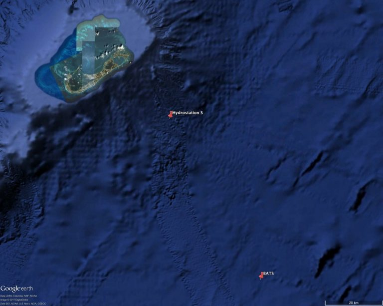

## Introduction

Coral reefs are among the most diverse ecosystems on our planet, maintaining about a quarter of marine life, and providing human services that range from fisheries to tourism (Eyre et al., 2014). Their structure is formed through the accumulation of the aragonite (CaCO3) skeleton of scleractinian corals, as well as other calcifying organisms such as bryozoans, echinoderms, and foraminifera (Kleypas et al., 1999). Atmospheric CO2 levels have increased from \~280ppm in pre-industrial times to current concentration of \~420ppm. This rise in CO2 will cause the pH of ocean water to decrease and acidity to increase, a process commonly referred to as ocean acidification.

Effects of ocean acidification are known to affect marine calcifiers by reducing growth rates through a shift from CaCO3 precipitation towards dissolution, negatively impacting marine calcifiers ability to form their skeletal structure. Research has shown how an increase in atmospheric carbon dioxide (pCO2) has led to a lowering of the pH of surface oceans of about 0.1 units. A way to quantify effects of ocean acidification is through saturation state, which is inherently linked to ocean acidification and carbonate chemistry variability. Variability in carbonate chemistry can make it difficult to understand these processes, since they are dependent on ecological, geochemical, and physical factors. Understanding seawater carbonate chemistry variability is therefore an effective and helpful tool for predicting global and local changes in coral reef ecosystems.

This lab report will analyze carbonate chemistry data collected from the Bermuda Atlantic Time-series (BATS) study, which began in 1988. The goal of the BATS study is to record interannual chemistry and biological variability of the mixed layer and euphotic zone in order to establish global trends on carbonate chemistry, biological and physical properties over time. BATS study is part of an international and multidisciplinary study which aims to understand the role of carbon nutrient cycles on a global scale.

## Methods

Samples were collected from monthly cruises at BATS station, located at the Sargasso Sea near Bermuda (Figure 1). Thus study has recorded continuous observations for approximately three decades. Data was downloaded from BATS website which can be accesed [here](https://bats.bios.edu/bats-data/). Once downloaded, carbonate chemistry data was analyzed for the mixed surface layer (first 100 meters) using RStudio. Carbonate chemistry variables such as pH, pCO2 and Aragonite saturation state where calculated using CO2 sys, specifically from the "seacarb" package. Time series where plotted with respect to pCO2, pH and Aragonite saturation state to explain interannual trends as well as to see if there is seasonal variability. This lab report aims to answer (1) is surface pCO2 increasing, (2) is surface pH decreasing and (3) is surface saturation state with respect to aragonite decreasing.

*Figure 1:* Hydrostation S and BATS samplng sites.

{width="479"}

## Results

```{r setup, include=TRUE}
#Load Libraries
#install.packages("performance")
#install.packages("see")
#install.packages("tidyverse")
library(performance)
library(tidyverse)
library(seacarb)
```

```{r}
##Import data
bats_bottle <- read_delim("bats_bottle.txt", 
                          delim = "\t", escape_double = FALSE, 
                          col_names = FALSE, trim_ws = TRUE, skip = 60)
colnames(bats_bottle)<- colnames(read_csv("bats_bottle.txt",skip=59))
View(bats_bottle)
```

```{r}
#Calculate CO2 chemistry parameters

#Check which variables missing
#carb(flag, var1, var2, S=35, T=25, Patm=1, P=0, Pt=0, Sit=0,
     #k1k2="x", kf="x", ks="d", pHscale="T", b="u74", gas="potential", 
     #warn="y", eos="eos80", long=1.e20, lat=1.e20)
#Missing pressure

#Calculate pressure using TEOS-10
?gsw
#p=gsw_p_from_z(z,lat)
bats_co2=
  bats_bottle %>% 
  mutate(P_dbar=gsw_p_from_z(Depth*-1,latN))
View(bats_co2)


```

```{r}
#flag = 15 ALK and DIC given
?carb
bats_co2sys=
  bats_co2 %>% 
  filter(Alk!=-999,CO2!=-999,Sal1!=-999,Temp!=-999,
         P_dbar!=-999,PO41!=-999,Si1!=-999,
         lonW!=-999,latN!=-999)%>% 
  rename(DIC=CO2) %>% 
  mutate(carb(flag=15, var1=Alk*10^-6, var2=DIC*10^-6, 
              S=Sal1, T=Temp, Patm=1, P=P_dbar*10^-1, 
              Pt=PO41*10^-6, Sit=Si1*10^-6,
              k1k2="l", kf="pf", ks="d", pHscale="T", 
              b="u74", gas="potential", 
              warn="y", eos="eos80",long=360-lonW, lat=latN))

#filter for only the surface ocean
bats_co2sys_surf = bats_co2sys %>% 
  filter(Depth<100) %>%  #selecting only the upper 100m-representative of surface water
  filter(pCO2insitu>100) #BATS told Dr. Courtney this point was bad so I am not going to include itit will not be included

View(bats_co2sys_surf)
```

#### *Is surface ocean pCO2 increasing?*

Atmospheric CO2 time series showed a consistent increase in surface pCO2 for BATS data. Linear model presented an R\^2 of 0.2915 and detected an annual significant (p value\< 2.2e-16) increase of 1.86 uatm per year. There is also seasonal variability of surface pCO2 with higher concentrations in summer to early fall (warmer months) and lower concentrations during winter and early spring (colder months).

```{r}
#bats_co2sys_surf %>% 
 # ggplot(mapping=aes(x=decy,y=pCO2insitu))+
  #geom_point()+
 # geom_smooth()

pco2_model = lm(pCO2insitu~decy,data=bats_co2sys_surf)


check_model(pco2_model) 

summary(pco2_model) 
anova(pco2_model) 

# Plot model predictions

bats_co2sys_surf_pred=
  bats_co2sys_surf %>% 
  mutate(predict(pco2_model,interval='confidence',level=0.95))


bats_co2sys_surf_pred=
  cbind(bats_co2sys_surf, predict(pco2_model, interval = 'confidence',level=0.95))

#add prediction line to ggplot
pco2_plot=
  bats_co2sys_surf_pred %>% 
  ggplot()+
  geom_point(mapping=aes(x=decy,y=pCO2insitu))+
  geom_line(aes(decy,fit),color="red")+
  geom_ribbon(aes(x=decy,ymin=lwr,ymax=upr),alpha=0.6,fill="red")+
  xlab("Year")+
  ylab("pCO2 (µatm)")+
  scale_x_continuous(breaks=seq(1990,2020,5))+
  scale_y_continuous(breaks=seq(290,560,50))+
  theme_classic()
  
print(pco2_plot)


```

*Figure 2:* pCO2 BATS time series. Linear model with shaded region showing 95% confidence intervals.

#### *Is surface ocean seawater pH decreasing?*

BATS surface pH time series showed a consistent decrease in pH. Linear model presented an R\^2 of 0.2435 and detected an annual significant (p value\< 2.2e-16) decrease of -1.793e-03 per year. There is also seasonal variability of surface pH with lower values in summer to early fall (warmer months)and higher values during winter and early spring (colder months).

```{r}

#bats_co2sys_surf %>% 
  #ggplot(mapping=aes(x=decy,y=pH))+
  #geom_point()+
  #geom_smooth()

pH_model = lm(pH~decy,data=bats_co2sys_surf)
summary(pH_model)

check_model(pH_model) #model assumptions appear valid

# Also summary is using ANOVA to produce p-values
summary(pH_model) #pvalue is same as anova
anova(pH_model) #pvalue is same as summary

#How do we plot our model predictions?

#the tidy way with dplyr but we need to rename outputs
bats_co2sys_surf_pred_pH=
  bats_co2sys_surf %>% 
  mutate(predict(pH_model,interval='confidence',level=0.95))

#the base R way with cbind and do not need to rename outputs
bats_co2sys_surf_pred_pH=
  cbind(bats_co2sys_surf, predict(pH_model, interval = 'confidence',level=0.95))

#add prediction line to ggplot
pH_plot=
bats_co2sys_surf_pred_pH %>% 
  ggplot()+
  geom_point(mapping=aes(x=decy,y=pH))+
  geom_line(aes(decy,fit),color="purple")+
  geom_ribbon(aes(x=decy,ymin=lwr,ymax=upr),alpha=0.6,fill="purple")+
  xlab("Year")+
  ylab("pH")+
  scale_x_continuous(breaks =seq(1990,2020,5))+
  theme_classic()
print(pH_plot)
```

*Figure 3*: pH BATS time series. Linear model with shaded region showing 95% confidence intervals.

#### *Is surface ocean seawater saturation state with respect to aragonite decreasing?*

BATS surface saturation state for aragonite showed a consistent decrease in saturation state through time. Linear model presented an R\^2 of 0.06805 and detected an annual significant (p value\< 2.2e-16) decrease of -0.0058313 per year. There is also seasonal variability of surface aragonite saturation state with lower values in summer to early fall (warmer months)and higher values during winter and early spring (colder months).

```{r}
#bats_co2sys_surf %>% 
 # ggplot(mapping=aes(x=decy,y=OmegaAragonite))+
  #geom_point()+
 # geom_smooth()

arg_model = lm(OmegaAragonite~decy,data=bats_co2sys_surf)
summary(arg_model)

check_model(arg_model) #model assumptions appear valid

# Also summary is using ANOVA to produce p-values
summary(arg_model) #pvalue is same as anova
anova(arg_model) #pvalue is same as summary

#How do we plot our model predictions?

#the tidy way with dplyr but we need to rename outputs
bats_co2sys_surf_pred_arg=
  bats_co2sys_surf %>% 
  mutate(predict(arg_model,interval='confidence',level=0.95))

#the base R way with cbind and do not need to rename outputs
bats_co2sys_surf_pred_arg=
  cbind(bats_co2sys_surf, predict(arg_model, interval = 'confidence',level=0.95))

#add prediction line to ggplot
arg_plot=
bats_co2sys_surf_pred_arg %>% 
  ggplot()+
  geom_point(mapping=aes(x=decy,y=OmegaAragonite))+
  geom_line(aes(decy,fit),color="blue")+
  geom_ribbon(aes(x=decy,ymin=lwr,ymax=upr),alpha=0.2,fill="blue")+
  scale_x_continuous(breaks=seq(1990,2020,5))+
  xlab("Year")+
  ylab("Omega Aragonite")+
  theme_classic()
print(arg_plot)
```

*Figure 4:* Aragonite saturation state time series. Linear model with shaded region showing 95% confidence intervals.

## Discussion

Based on the previous results, BATS carbonate chemistry data suggests ocean acidification at the Sargasso Sea. Time series data presented an overall an increase in pCO2 (1.86uatm/year) and a decrease in both pH (-1.793e-03/year) and saturation state for aragonite (-0.0058313/year). As pCO2 dissolves in seawater, it reacts to form carbonic acid (H~2~CO~3~), leading to more acidic oceans and therefore a decrease in pH. This decrease in sea surface pH would cause a shift towards dissolution, lowering the saturation state. Results of BATS was consistent with the literature, in which a decrease in pH as well as saturation state could potentially affect the ability of marine calcifiers to form their shells. Time series data also presented seasonality between the variables studied. In order to further study seasonal changes factors such as metabolism and respiration dates, as well as diel cycles should be considered.

## References

Crook, E., Cohen, A., & Robolledo-Vieyra, M. (2013). Reduced calcification and lack of acclimatization by coral colonies growing in areas of persistent natural acidification. *PNAS*, *110*, 11044--11049.

Eyre, B. D., Andersson, A. J., & Cryonak, T. (2014). Benthic coral reef calcium carbonate dissolution in an acidifying ocean. *NATURE CLIMATE CHANGE*, *4*, 969--976.

Kleypas, J. A., Buddermeier, R. W., & Archer, D. (1999). Geochemical Consequences of Increased Atmospheric Carbon Dioxide on Coral Reefs. *SCIENCE*, *284*, 118--120.

*Bermuda Biological Station For Research , Inc,. Bermuda Atlantic Time-series Study: Methods Report*. Bermuda Institute of Ocean Sciences. (n.d.). Retrieved from <https://bats.bios.edu/wp-content/uploads/2017/07/report_methods.pdf>
